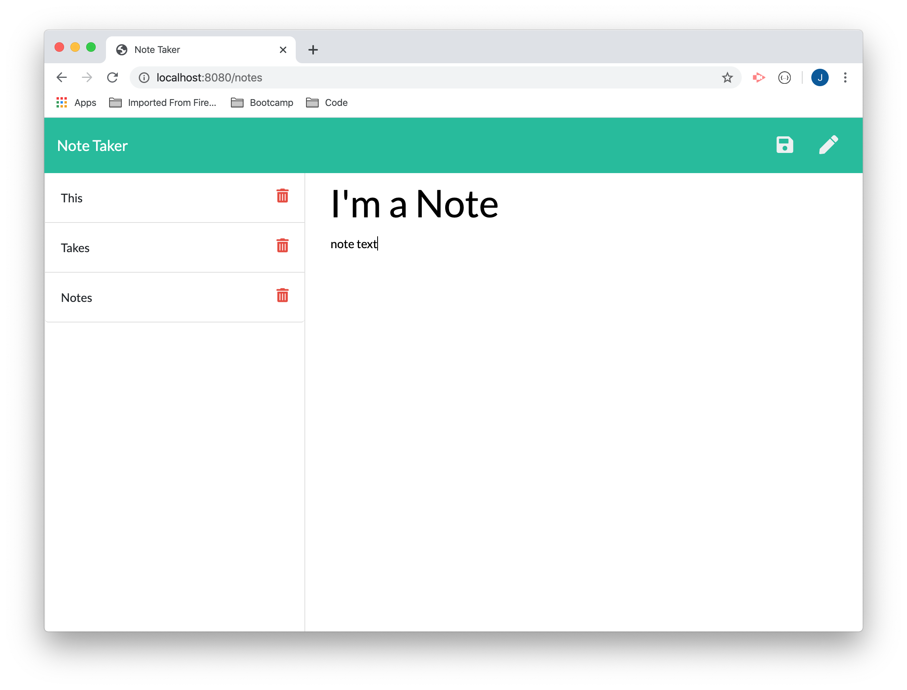

# Note Taker
    
# Description
    An app for taking notes. The user can enter as many notes as she likes, and they will be stored in JSON format on the server and retrieved the next time the user visits the sit. The user can also delete notes. 

# Installation
This app requires Node.js, Express, UUID.   

    

